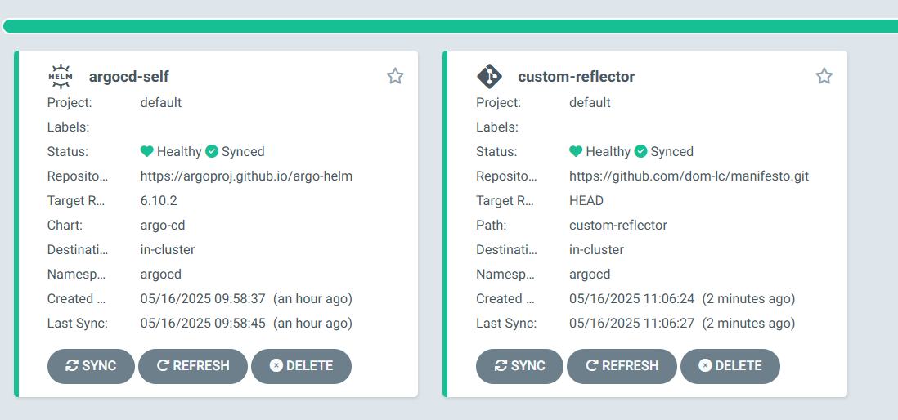
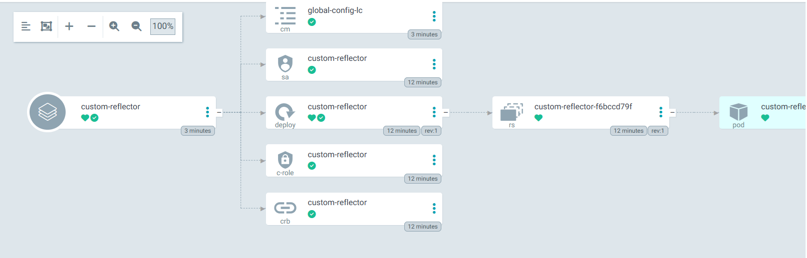

# GitOps

Playing with ArgoCd</br></br>
This is for purpose of testing and showcasing usecases; be aware that some techniques employed will not consist of the best security practices, or be 100% relevant to your comply with your needs.  

## Infrastructure

### setup.sh

The ```./_infrastucture``` contains a ```setup.sh``` script necessary to play with the current repo. Open a terminal in the infrastructure root and run the script [setup.sh](./infrastructure/setup.sh) as root.
It will install Kind and start a single node cluster for your on your local.
</br>*Please Note: this script has been made to be ran on a Ubuntu 24.04 WSL. Will work fine on Ubuntu VM to.*</br></br>

When the script has finished running, you will see your argocd credentials, you can simply login to the ArgoCD UI on localhost:8080. The credentials will be shown for you in your terminal before port-forwarding the service.</br>
*Note: do not close this terminal as it is responsible for the prot-forwarding*

### env-init.sh

The ```./_infrastucture``` contains a ```env-init.sh```script that will make use of the application object to self manage itself. It references the chart used byour ```setup.sh``` script (argocd helm chart v6.10.2 as used by lc) and takes it's values from our values file located in our ```./apps/argocd```.<br>
Once applied, you will now see your argocd-self application in your argocd's UI. You can also run ```kubectl -n argocd get configmap argocd-cm -o jsonpath="{.data.url}" && echo``` to validate your values have successfully been applied.

## Testing Helm Without Helm repository

It is now time to test helm that is pointing on a non-helm repositoryand passing it my values from ```apps/custom-reflector/values-sandbox.yaml```. The repository containint myhelm chart is [my manifesto repository](https://github.com/dom-lc/manifesto).
As a partner mentioned with the [argo doc](https://argo-cd.readthedocs.io/en/stable/user-guide/multiple_sources/) let's do this.

*argo-cd-application-example.yaml*
```yaml
apiVersion: argoproj.io/v1alpha1
kind: Application
spec:
  sources:
  - repoURL: 'https://prometheus-community.github.io/helm-charts'
    chart: prometheus
    targetRevision: 15.7.1
    helm:
      valueFiles:
      - $values/charts/prometheus/values.yaml
  - repoURL: 'https://git.example.com/org/value-files.git'
    targetRevision: dev
    ref: values
```

We will be trying to tweak this example since our repo is not a Helm repository and our chat is not packed or versioned. Hence why the 

```yaml
sources:
  - repoURL: 'https://prometheus-community.github.io/helm-charts'
    chart: prometheus
    targetRevision: 15.7.1
```

Is useless here. Lets apply the chart url and pass our values as

*deployments/application.custom-reflector.yaml*
```yaml
apiVersion: argoproj.io/v1alpha1
kind: Application
metadata:
  name: custom-reflector
  namespace: argocd
spec:
  project: default
  sources:
    - repoURL: https://github.com/dom-lc/manifesto.git
      targetRevision: HEAD  
      path: custom-reflector
      helm:
        valueFiles:
          - $values/apps/custom-reflector/values-sandbox.yaml
    - repoURL: https://github.com/dom-lc/gitops.git
      targetRevision: HEAD
      ref: values
  destination:
    server: https://kubernetes.default.svc
    namespace: argocd
  syncPolicy:
    automated:
      prune: true
      selfHeal: true
    syncOptions:
      - CreateNamespace=true
```

To create this application, use: ```kubectl apply -f deployments/application.custom-reflector.yaml```.

### Works

After deploying we can see our application is created and synced</br>



</br></br>
We can also see it created all our desired customconfig and dependencies</br>


